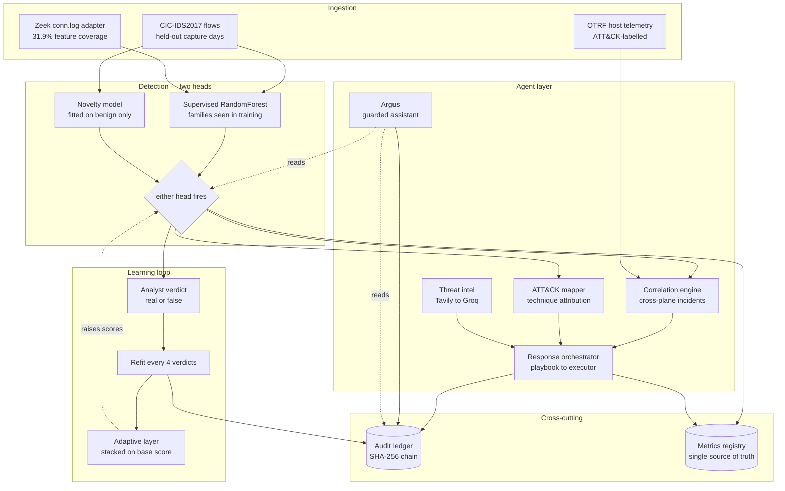
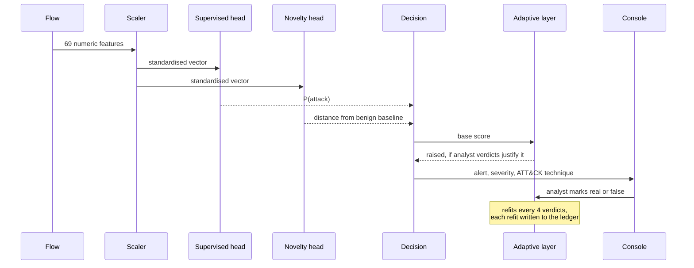
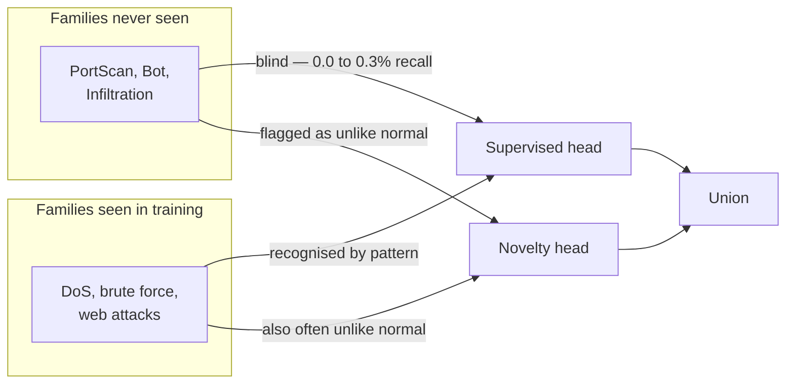
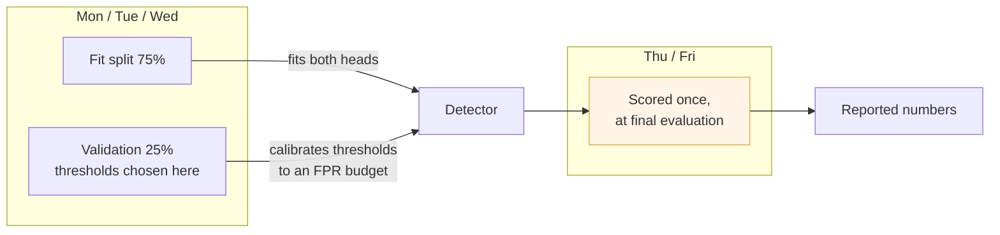
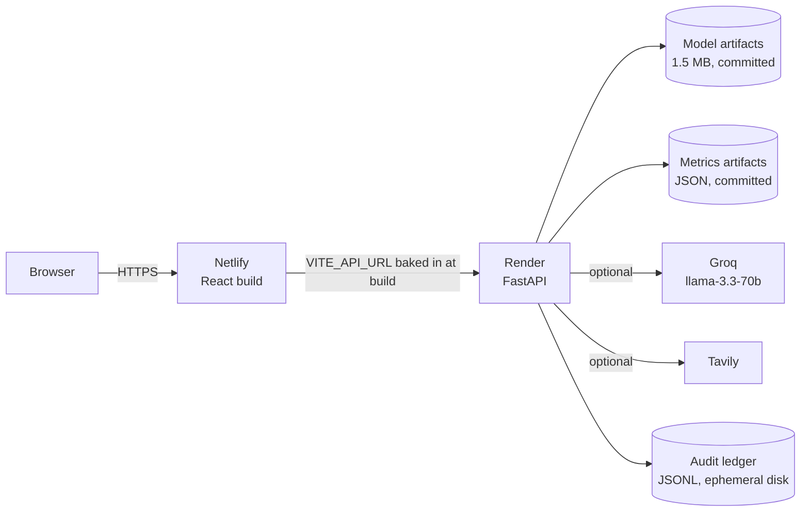

# CyberSentinel — architecture

A named deliverable of PS#7. Diagrams are Mermaid, so they render in GitHub and stay in
version control rather than drifting away in a slide.

---

## System

## Detection path for one flow

## Why two heads

A supervised classifier cannot recognise a class nobody showed it. The novelty head never
sees an attack during fitting — only benign traffic — so what it catches owes nothing to
prior knowledge of the attack. That is the behavioural layer PS#7 asks for.

## Evaluation discipline

Thresholds are never chosen on the days used to report results. That is the difference
between a measured number and a tuned one.

## Deployment

Measured footprint: 234 MB RSS against Render's 512 MB free tier. The LLM services are
optional — detection, the learning loop, metrics and the audit chain all work without them.

## What is deliberately absent

| Named in PS#7 | Status |
|---|---|
| CVE prioritisation agent | Not built. Needs a real asset inventory and a live NVD feed; a thin version would be demo-ware. |
| Cyber resilience digital twin | Not built. A project in its own right. |
| RAG over CERT-In advisories | Not built. Would need a scraped corpus we do not have. |
| Persistence, auth, multi-process | Not built. Single-process demo; the ledger resets with the dyno. |

See [GAPS.md](GAPS.md) for the full audit.
